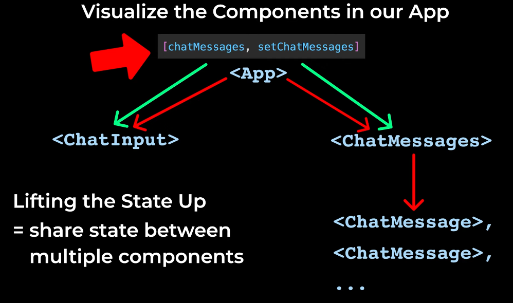

# Lesson 3 – State, Event Handlers, Create the Chatbot Features

## Lesson Summary

1. **Save the data**
   - Using arrays and objects

2. **Generate the HTML**
   - Using `.map()`
   - Using the `key` prop

3. **Make it interactive**
   - Using `onClick`
   - Using `onChange`

4. **State**
   - Data that changes over time
   - Connected to the HTML

5. **Updater function**
   - Updates the state
   - Updates the HTML

6. **Array Destructuring**

7. **Lifting the State Up**
   - Share state between components

    

8. **Made `<ChatInput>` interactive**
   - Handled user input
   - Updated state based on input

9. **Implemented Chatbot responses**
   - Generated responses
   - Displayed responses using components
